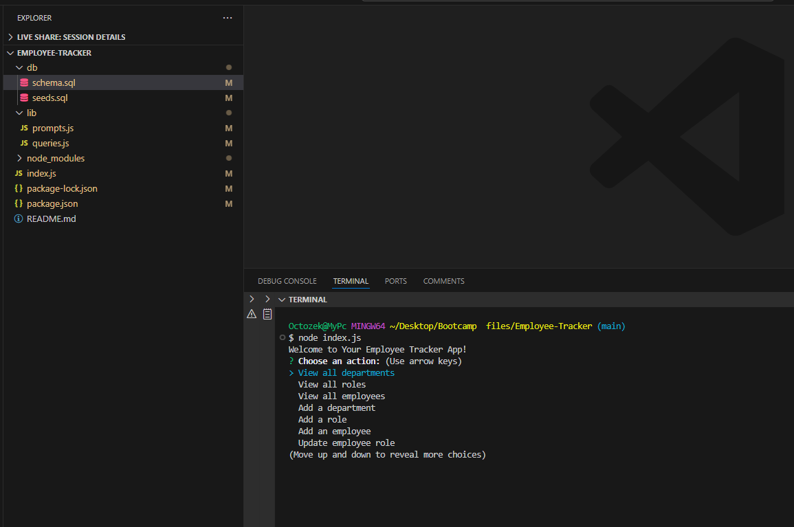

# Employee Tracker

## Description

The Employee Tracker is a command-line application built to manage a company's employee database. Using Node.js, Inquirer, and MySQL, this application allows users to view and manage departments, roles, and employees within the company.




## Table of Contents

- [Installation](#installation)
- [Usage](#usage)
- [Walkthrough Video](#walkthrough-video)
- [License](#license)
- [Questions](#questions)

## Installation

To install the necessary dependencies, run the following command:

```bash
npm install
```
## Usage

To invoke the application, run the following command in your terminal:

```bash
node index.js
```

## Features

1. **View All Departments:**
   - Displays a formatted table showing department names and department IDs.

2. **View All Roles:**
   - Displays a formatted table showing job titles, role IDs, the department each role belongs to, and salaries.

3. **View All Employees:**
   - Displays a formatted table showing employee IDs, first names, last names, job titles, departments, salaries, and managers.

4. **Add a Department:**
   - Prompts the user to enter the name of a new department and adds it to the database.

5. **Add a Role:**
   - Prompts the user to enter the name, salary, and department ID for a new role and adds it to the database.

6. **Add an Employee:**
   - Prompts the user to enter the first name, last name, role ID, and manager ID for a new employee and adds it to the database.

7. **Update an Employee Role:**
   - Prompts the user to select an employee and update their role, reflecting the changes in the database.

8. **Exit:**
   - Exits the application.

## Walkthrough Video

A walkthrough video demonstrating the functionality of the Employee Tracker application can be found [here](https://youtu.be/53K2xc5N8tw).

## License

This project is licensed under the ISC License.

## Questions

If you have any questions about the repository, open an issue or contact me directly at [octozek@gmail.com](mailto:octozek@gmail.com). You can find more of my work at [Octozek](https://github.com/Octozek).

## GitHub Repository

The GitHub repository for this project can be found [here](https://github.com/Octozek/Employee-Tracker).
